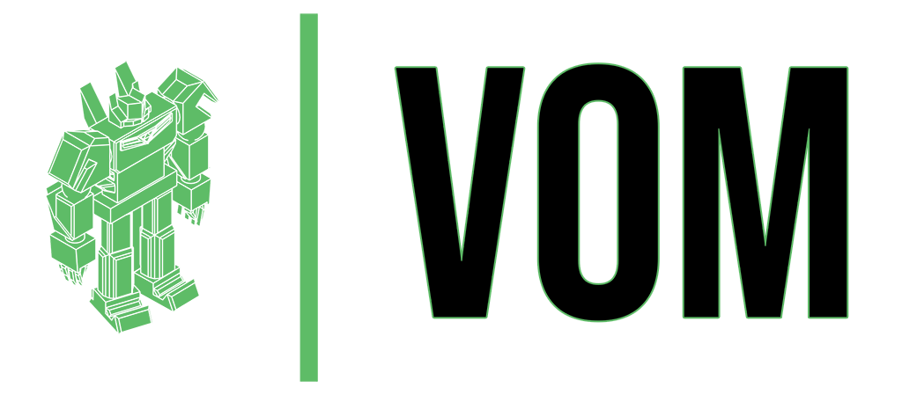

# Versatile Object Mapper Documentation

[](https://github.com/zolex/vom/actions)
[](https://github.com/zolex/vom/actions)
[](https://codecov.io/gh/zolex/vom)
[](https://packagist.org/packages/zolex/vom)

[](https://packagist.org/packages/zolex/vom)
[](https://packagist.org/packages/zolex/vom)
[](https://packagist.org/packages/zolex/vom)




The Versatile Object Mapper - or in short VOM - is a PHP library to transform any data structure into strictly typed models, by simply adding PHP attributes to existing classes.

<!-- toc -->

- [Recommended Workflow](#recommended-workflow)
- [The Object Mapper](#the-object-mapper)
  * [Deserialization](#deserialization)
  * [Denormalization](#denormalization)
  * [Serialization](#serialization)
  * [Normalization](#normalization)
- [Attribute Configuration](#attribute-configuration)
  * [The Accessor](#the-accessor)
  * [Constructor Arguments](#constructor-arguments)
  * [Constructor Property Promotion](#constructor-property-promotion)
  * [Method Calls](#method-calls)
    + [Denormalizer Methods](#denormalizer-methods)
    + [Normalizer Methods](#normalizer-methods)
  * [Disable Nesting](#disable-nesting)
  * [Root flag](#root-flag)
  * [Collections](#collections)
    + [Native Array Collections](#native-array-collections)
    + [ArrayAccess Collections](#arrayaccess-collections)
    + [Doctrine Collections](#doctrine-collections)
    + [Denormalize a Collection](#denormalize-a-collection)
  * [Collection of Collections](#collection-of-collections)
  * [Data Types](#data-types)
    + [Strict Types](#strict-types)
    + [Union Types](#union-types)
    + [Booleans](#booleans)
    + [DateTime](#datetime)
- [Interfaces and Abstract Classes](#interfaces-and-abstract-classes)
- [Context](#context)
  * [Skip Null Values](#skip-null-values)
  * [Disable Type Enforcement](#disable-type-enforcement)
  * [Object to Populate](#object-to-populate)
  * [Groups](#groups)
  * [Circular References](#circular-references)

<!-- tocstop -->

## Recommended Workflow
When starting a new project or refactoring an existing one, you should always design your models first. For example If it's an API-Platform REST API, the design of your models will directly reflect it's OpenAPI specification.
If you have the need to receive an arbitary data format in your existing application, the models should already be in place. This is a great starting point vor the Versatile Object Mapper.
The models can be anything, so if you receive data from somewhere and need to write it to a database, the models can also be Doctrine Entities. See the example [API-Platform with Doctrine](https://github.com/zolex/vom-examples/tree/main/api-platform-doctrine).

1. **The first step always is to design your models.** _At this point you should not implement any business logic. Just the plain models._
2. **Now it makes sense to add the VOM attributes to your models.** _This way you avoid changing the mapping attributes as your models evolve._
3. **Finally, implement your business logic.** _With well-designed models, automatically fed by VOM, implementing your business logic will be a piece of cake._


## The Object Mapper

In symfony framework you can simply use dependency injection to gain access to the preconfigured object mapper service. Also see the [Symfony example](https://github.com/zolex/vom-examples/tree/main/symfony-framework).
The recommended way to use it is by type-hinting Symfony's `SerializerInterface` or `VersatileObjectMapper`.

The only difference is, that `VersatileObjectMapper` by default processes the VOM attributes and Serializer does not.

```php
use Zolex\VOM\Serializer\VersatileObjectMapper;

class AnySymfonyService
{
    public function __construct(private VersatileObjectMapper $objectMapper)
    {
    }
    
    public function deserialize(): void
    {
        $person = $this->objectMapper->deserialize('{"id": 123, "firstname": "Peter"}', Person::class);
    }
}
```

Symfony Serializer needs additional context to enable the VersatileObjectMapper, to not interfere with the framework's behavior if not explicitly wanted (especially with API-Platform).
A particular use-case for this is API-Platform, where it would otherwise always return the VOM normalized data.
Check the [custom StateProvider](https://github.com/zolex/vom-examples/tree/main/api-platform-custom-state/src/State/PersonStateProvider.php) and the [Person Resource](https://github.com/zolex/vom-examples/tree/main/api-platform-custom-state/src/ApiResource/Person.php) in the API-Platform example with custom state.

```php
use Symfony\Component\Serializer\SerializerInterface;
class AnySymfonyService
{
    public function __construct(private SerializerInterface $serializer)
    {
    }
    
    public function deserialize(): void
    {
        $person = $this->serializer->deserialize('{"id": 123, "firstname": "Peter"}', Person::class, context: ['vom' => true]);
    }
}
```

Without symfony framework, you can construct the mapper yourself or simply use the factory. Also see the [plain php example](https://github.com/zolex/vom-examples/tree/main/without-framework). You can pass the `create()` method any `\Psr\Cache\CacheItemPoolInterface` to cache the model's metadata and avoid analyzing it on each execution of your application.

```php
$objectMapper = \Zolex\VOM\Serializer\Factory\VersatileObjectMapperFactory::create();
```

> [!TIP]
> The `PropertyInfoExtractorFactory` creates a default set of extractors utilizing Reflection and PhpDoc. Several other extractors are available in Symfony, such as PHPStan and Doctrine. You can also write a custom extractor to give VOM additional information on your model's properties.

### Deserialization

The object mapper can process several kinds of serialized data, such as JSON or XML. To create a model instance from the input data, simply call the `deserialize()` method on the mapper.

```php
$person = $objectMapper->deserialize($jsonString, Person::class);
```


### Denormalization

If your data is already an array or object, you can call the `denormalize()` method on the mapper to create a model instance from it. 

The object mapper can process any kind of PHP data structure as input. This includes arrays, plain old PHP objects, class instances and any combination and nesting of all these.
So the input data might be an indexed array, an associative array an stdClass, other class instances with private properties and their own getters and setters as well as several collections.

```php
$person = $objectMapper->denormalize($data, Person::class);
```

### Serialization

To create a string representation of a model, such as JSON, you can call the `serialize()` method on the object mapper.

```php
$jsonString = $objectMapper->serialize($personModel, 'json'); // json is the default
```

### Normalization

If you need a native php array representation of your model you can call the `normalize()` method.

```php
$array = $objectMapper->normalize($personModel);
```

If you need it converted to an object, use the `toObject()` method and pass it the denormalization result (this is not just casting, but deeply converting the whole data structure, just leaving indexed, sequential arrays intact).

```php
$object = \Zolex\VOM\Serializer\VersatileObjectMapper::toObject($array);
```

## Attribute Configuration

When attributes with no arguments are added to the model properties, VOM will utilize its default behavior, which essentially is the same as the standard symfony object normalizer.
Meaning that in this case no actual data transformation will be done, it will simply inject the values from the data structure where they match in the same structure of your models.

```php
use Zolex\VOM\Mapping as VOM;

#[VOM\Model]
class RootClass
{
    #[VOM\Property]
    public string $rooted;
    
    #[VOM\Property]
    public NestedClass $nested;
}

#[VOM\Model]
class NestedClass
{
    #[VOM\Property]
    public string $value;
}
```

```php
$data = [
    'rooted' => 'I live on the root',
    'nested' => (object)[
        'value' => 'I am a nested value'
    ];
];

$objectMapper->denormalize($data, RootClass:class);
```

As the data structures and names of all properties are identical, no additional configuration is required. _But as mentioned above, in this scenario you probably just want to use a symfony normalizer to save resources._

> [!TIP]
> Every model that should be processed by VOM needs the `#[VOM\Model]` attribute, so does every property need the `#[VOM\Property]`attribute.
> This includes every nested model and property. On the one hand this increases performance by not trying to process each and everything.
> It can make sense to have additional nested models and properties which are never touched the VOM, for example if you use some of the fed data,
> to do further computations and add it to a model, before returning it to the client, sending it to an API or storing it in the database.


### The Accessor

The first argument of the property attribute is the accessor. When not provided, it uses the property's name. It can be written in the following ways.

```php
#[VOM\Property('[source_param]')]
public string $value;
```

Or to be more explicit:

```php
#[VOM\Property(accessor: '[source_param]')]
public string $value;
```

The accessor is not just the name of a parameter, it is [symfony property access syntax](https://symfony.com/doc/current/components/property_access.html).
Note that **VOM always uses the object syntax**, even if the input data is an array! This way the syntax is independent of the type of input. The only exception when array is kept, is when it is an indexed, sequential array!


```php
use Zolex\VOM\Mapping as VOM;

#[VOM\Model]
class RootClass
{
    #[VOM\Property]
    public string $onTheRoot;
    
    #[VOM\Property('[deeper][inThe][structure]')]
    public string $fromTheDeep;
}
```

```php
$data = [
    'onTheRoot' => 'I live on the root',
    'deeper' [
        'inThe' => [
            'structure' => 'I live somewhere deeper in the data structure'
        ]
    ]
];

$objectMapper->denormalize($data, RootClass::class);
```

### Constructor Arguments

Similar to the `VOM\Property` attribute there is the `VOM\Argument` attribute, that can be added on constructor arguments
_(Actually both are using the same abstract class under the hood, this differentiation is only here for better semantics)._
VOM will pass the mapped values into the constructor. All required arguments must be property mapped and be present in the source data.
Otherwise, VOM can not create an instance of the model. Nullable arguments and those with a default value are optional in the source data.

```php
use Zolex\VOM\Mapping as VOM;

#[VOM\Model]
class ConstructorArguments
{
    private int $id;
    private string $name;
    private ?bool $nullable;
    private bool $default;

    public function __construct(
        #[VOM\Argument]
        int $id,
        #[VOM\Argument]
        string $name,
        #[VOM\Argument]
        ?bool $nullable,
        #[VOM\Argument]
        bool $default = true
    ) {
        $this->id = $id;
        $this->name = $name;
        $this->nullable = $nullable;
        $this->default = $default;
    }
}
```

> [!NOTE]
> When using the [`object_to_populate` context](#object-to-populate), the constructor arguments and constructor property promotion will be skipped.


### Constructor Property Promotion

Also, constructor property promotion can be handled by VOM in the same way as the normal constructor arguments described above.

```php
use Zolex\VOM\Mapping as VOM;

#[VOM\Model]
class PropertyPromotion
{
    public function __construct(
        #[VOM\Argument]
        private int $id,
        #[VOM\Argument]
        private string $name,
        #[VOM\Argument]
        private ?bool $nullable,
        #[VOM\Argument]
        private bool $default = true,
    ) {
 }
```

### Method Calls

#### Denormalizer Methods

If your models don't follow standard getter and setter naming conventions, VOM can call custom methods with arguments. It will query the source data using the argument accessor (the same way as for VOM\Property) and call the method. It is required to add the `VOM\Denormalizer` attribute on the method to be called.

> [!NOTE]
> Only consider to use this if you do not have the option to change your models to comply with the conventions for getters and setter or for edge-cases, like you want to reuse a generic model class but with different accessors.

```php
use Symfony\Component\Serializer\Attribute\Groups;
use Zolex\VOM\Mapping as VOM;

#[VOM\Model]
class Calls
{
    private GenericModel $one;
    private GenericModel $two;

    #[VOM\Denormalizer]
    public function setOne(
        #[VOM\Argument('[ID_FOR_ONE]')]
        int $id,
        #[VOM\Argument('[NAME_FOR_ONE]')]
        string $name,
    ): void {
        $this->one = new GenericModel($id, $name);
    }
    
    #[Groups(['group-name'])]
    #[VOM\Denormalizer]
    public function setTwo(
        #[VOM\Argument('[ID_FOR_TWO]')]
        int $id,
        #[VOM\Argument('[NAME_FOR_TWO]')]
        string $name,
    ): void {
        $this->two = new GenericModel($id, $name);
    }
}
```

Also, it is possible to use the Groups attribute to control if the method should be called during denormalization, depending on the groups in the denormalization context.

```php
$objectMapper->denormalize($data, Calls:class, context: ['groups' => ['group-name']]);
```

#### Normalizer Methods

Similar to the denormalizer methods, also normalizer methods can be configured to be called during normalization. These methods must not have any required arguments. 

Without an accessor, the normalizer must return an array which is merged into the normalized data. So the keys of that returned array will be the keys in the normalized output.

```php
use Symfony\Component\Serializer\Attribute\Groups;
use Zolex\VOM\Mapping as VOM;

#[VOM\Model]
class Calls
{
    #[VOM\Mormalizer]
    public function getData(): array
    {
        return [
            'normalized_key' => 'something',
            'another_key' => 123,
        ]
    }
}
```

If a normalizer has an accessor, the return value can be anything and VOM will put it at the given path.

```php
use Symfony\Component\Serializer\Attribute\Groups;
use Zolex\VOM\Mapping as VOM;

#[VOM\Model]
class Calls
{
    #[VOM\Mormalizer(accessor: '[path][in][output]')]
    public function getAnything(): mixed
    {
        return 'anything, even an object or array';
    }
}
```

> [!CAUTION]
> It is possible to normalize data and denormalize a model while maintaining the exact same results, no matter how often you repeat this process.
> If this is one of your requirements, and you are using Normalizer and Denormalizer methods, you have to be careful how you store the injected data
> and how you return it, so that the results are matching.

Here is a short example. Note, that the keys and structure returned from the normalizer method match the accessors from the denormalizer arguments.

```php
use Symfony\Component\Serializer\Attribute\Groups;
use Zolex\VOM\Mapping as VOM;

#[VOM\Model]
class Calls
{
    private GenericModel $data;

    #[VOM\Denormalizer]
    public function setData(
        #[VOM\Argument('[NESTED][ID_FOR_ONE]')]
        int $id,
        #[VOM\Argument('[NESTED][NAME_FOR_ONE]')]
        string $name,
    ): void {
        $this->data = new GenericModel($id, $name);
    }
    
    #[VOM\Mormalizer]
    public function getData(): array
    {
        return [
            'NESTED' => [
              'ID_FOR_ONE' => $this->data->getId(),
              'NAME_FOR_ONE' => $this->data->getName(),
           ],
        ];
    }
}
```

### Disable Nesting

The data structures can be as deeply nested as you want. By default, nesting is enabled. That is when no accessor is given or the accessor is symfony property access syntax.

If a property is another `VOM\Model` (or any type of collection that contains models) and it has `accessor: false` configured, VOM will look for the nested model's properties on the same level as the property itself. 

```php
use Zolex\VOM\Mapping as VOM;

#[VOM\Model]
class RootClass
{
    #[VOM\Property]
    public string $rooted;
    
    #[VOM\Property(accessor: false)]
    public NestedClass $nested;
}

#[VOM\Model]
class NestedClass
{
    #[VOM\Property]
    public string $value;
}
```

```php
$data = [
    'rooted' => 'I live on the root',
    'value' => 'I am on the data root too'
];

$objectMapper->denormalize($data, RootClass::class);
```

VOM only disables nesting for properties, which explicitly have the accessor set to false. So other models that are deeper nested will not be flattened. This allows mapping between nested and _partially_ flattened data structures.

```php
use Zolex\VOM\Mapping as VOM;

#[VOM\Model]
class RootClass
{
    #[VOM\Property]
    public string $rooted;
    
    #[VOM\Property(accessor: false)]
    public NestedClass $nested;
}

#[VOM\Model]
class NestedClass
{
    #[VOM\Property]
    public string $value;
    
    #[VOM\Property]
    public ThirdDimension $deeper;
}

#[VOM\Model]
class ThirdDimension
{
    #[VOM\Property]
    public string $effectivelyOnSecondDimension;
}
```

```php
$data = [
    'rooted' => 'I live on the root',
    'value' => 'I am here too!',
    'deeper' [
        'effectivelyFromSecondDimension' => 'I am a nested value on the second dimension'
    ]
];

$objectMapper->denormalize($data, RootClass::class);
```

### Root flag

The `root` flag can can be used on every property (unlike `acessor: false` which only makes sense on properties that are other models). It will make VOM apply the property's accessor to the root of the source data.
When applied on a property that is a model, or any type of collection that contains other models, the data structure within that model will be kept intact. 

```php
use Zolex\VOM\Mapping as VOM;

#[VOM\Model]
class RootClass
{
    #[VOM\Property]
    public string $rooted;
    
    #[VOM\Property]
    public NestedClass $nested;
}

#[VOM\Model]
class NestedClass
{
    #[VOM\Property(root: true)]
    public string $value;
    
    #[VOM\Property]
    public ThirdDimension $deeper;
}

#[VOM\Model]
class ThirdDimension
{
    #[VOM\Property(root: true)]
    public string $effectivelyOnRoot;
}
```

```php
$data = [
    'rooted' => 'I live on the root',
    'value' => 'I am here too!',
    'effectivelyOnRoot' => 'Where else would you expect me?'
];

$objectMapper->denormalize($data, RootClass::class);
```

> [!NOTE]
> A combination of actual accessors, `accessor: false` and `root: true` gives you full control over the data mapping. Some results can be achieved with different combinations of these settings.
> But there are scenarios which can only be achieved with a clever combination of all of them.   


### Collections

VOM can process several types of collections, like native arrays or ArrayObject (including doctrine collections), basically any iterable that can be detected as such by the `PropertyInfoExtractor`.
To tell VOM what types sit in a collection you have to add PhpDoc tags and use the [phpdoc array or collection syntax](https://symfony.com/doc/current/components/property_info.html#type-iscollection) as shown in the following example.

#### Native Array Collections

```php
use Zolex\VOM\Mapping as VOM;

#[VOM\Model]
class RootClass
{
    // for a native array, use the array syntax
    /** @var Thing[] */
    #[VOM\Property]
    public array $valueCollection;
}

#[VOM\Model]
class Thing
{
    #[VOM\Property]
    public string $value;
}
```

#### ArrayAccess Collections

For all collections that implement `ArrayAccess` the model preferably should have adder and remover methods and the collection should be initialized in the constructor.

```php
use Zolex\VOM\Mapping as VOM;

#[VOM\Model]
class RootClass
{    
    // for ArrayAccess, use the collection syntax
    /** @var ArrayObject<Thing> */
    #[VOM\Property]
    private ArrayAccess $things;
    
    public function __construct()
    {
        $this->things = new ArrayObject();
    }
    
    public function addThing(Thing $thing): void
    {
        $this->things->append($thing);
    }
    
    public function removeThing(Thing $thing): void
    {
        // remove it from the ArrayAccess
    }
}
```

If you don't need to add or remove single collection items, and in your use-case it is acceptable to overwrite potentially existing items,
a simpler option is to create a mutator method that accepts an array.

```php
use Zolex\VOM\Mapping as VOM;

#[VOM\Model]
class RootClass
{    
    /** @var ArrayObject<Thing> */
    #[VOM\Property]
    private ArrayAccess $things;
    
    public function setThings(array $things): void
    {
        $this->things = new ArrayObject($things);
    }
}
```

#### Doctrine Collections

If you are working with symfony and create doctrine entities using the maker-bundle, all of this will be generated automatically. The following example is only here to show the extra `VOM\Model` and `VOM\Property` attributes you have to add.
You don't even need to add the `@var` PhpDoc for the collection value type because VOM can determine it by looking at the doctrine entity associations.

```php
use Doctrine\ORM\Mapping as ORM;
use Zolex\VOM\Mapping as VOM;

#[ORM\Entity()]
#[VOM\Model]
class DoctrineAddress
{
    #[ORM\Id]
    #[ORM\GeneratedValue]
    #[ORM\Column]
    #[VOM\Property]
    private ?int $id = null;

    #[ORM\Column(length: 255)]
    #[VOM\Property]
    private ?string $street = null;
}
```

```php
use Doctrine\Common\Collections\ArrayCollection;
use Doctrine\Common\Collections\Collection;
use Doctrine\ORM\Mapping as ORM;
use Zolex\VOM\Mapping as VOM;

#[ORM\Entity]
#[VOM\Model]
class DoctrinePerson
{
    #[ORM\Id]
    #[ORM\GeneratedValue]
    #[ORM\Column]
    #[VOM\Property]
    private ?int $id = null;

    #[ORM\Column(length: 255)]
    #[VOM\Property]
    private ?string $name = null;

    #[ORM\OneToMany(targetEntity: DoctrineAddress::class)]
    #[VOM\Property]
    private Collection $addresses;

    public function __construct()
    {
        $this->addresses = new ArrayCollection();
    }

    public function addAddress(DoctrineAddress $address): void
    {
        if (!$this->addresses->contains($address)) {
            $this->addresses->add($address);
        }
    }

    public function removeAddress(DoctrineAddress $address): void
    {
        $this->addresses->removeElement($address);
    }
}
```

#### Denormalize a Collection

If you want to pass the `denormalize()` method an array, it is required to also pass the array syntax for the model.

```php
$data = [
    'valueCollection' [
        [
            'value' => 'I am the value'
        ],
        [
            'value' => 'I am another value'
        ]
    ]
];

$person = $objectMapper->denormalize($collectionOfPeople, RootClass::class.'[]');
$person = $objectMapper->denormalize($collectionOfPeople, 'RootClass[]');
```

### Collection of Collections

It is also possible to define properties that are collections which contain further levels of collections.

```php
use Zolex\VOM\Mapping as VOM;

#[VOM\Model]
class CollectionOfCollections
{
    // an array of arrays
    /** @var array[] */
    #[VOM\Property]
    public array $array;

    // a collection of an array of DateAndTime models
    /** @var \ArrayObject<DateAndTime[]> */
    #[VOM\Property]
    public \ArrayAccess $collection;
}

#[VOM\Model]
class DateAndTime
{
    #[VOM\Property]
    public \DateTime $dateTime;
}
```

With the above configuration you can pass VOM the following data structure for denormalization.

```php
$data = [
    'array' => [
        [1, 2, 3],
        [4, 5, 6],
    ],
    'collection' => [
        [
            ['dateTime' => '2011-05-15 10:11:12'],
            ['dateTime' => '2012-06-16 10:11:12'],
        ],
        [
            ['dateTime' => '2013-07-15 10:11:12'],
            ['dateTime' => '2014-08-15 10:11:12'],
        ],
    ],
];

$collection = self::$serializer->denormalize($data, CollectionOfCollections::class);
```

### Data Types

#### Strict Types

By default, VOM will throw an exception if you are trying to denormalize a value that does not match the expected type. It is possible to [disable strict type checking](#disable-type-enforcement) using the context.

#### Union Types

By utilizing union types, you can work with strict typing and still allow several types to be denormalized.

```php
#[VOM\Property]
public int|float|null $value;
```

#### Booleans

In an arbitrary data structure, several values may represent a boolean value. If a property is a strictly typed boolean, VOM makes a handy decision whether a value is mapped to true or false.

```php
#[VOM\Property]
public bool $state;
```

The following values are considered to be `true`

```php
    true, 1, '1', 'on', 'ON', 'yes', 'YES', 'y', 'Y'
```

The following values are considered to be `false`

```php
    false, 0, '0', 'off', 'OFF', 'no', 'NO', 'n', 'N'
```

If your boolean is nullable, any value that does not match either the true or false list, the value will become null if it was uninitialized and stay null if it already was.

```php
#[VOM\Property]
public ?bool $nullableState;
```

For normalization purpose you can explicitly tell VOM which value you want to use to represent a boolean.

```php
#[VOM\Property(trueValue: 'ON', falseValue: 'OFF')]
public bool $nullableState;
```

#### DateTime

If VOM feeds a property that is a DateTime or DateTimeImmutable type, it will automatically convert the input value into the respective object. See more on the Symfony documentation

```php
use Symfony\Component\Serializer\Attribute\Context;
use Zolex\VOM\Mapping as VOM;

#[VOM\Model]
class DateTimeModel
{
    #[VOM\Property]
    public \DateTime $createdAt;
    
    #[Context(['datetime_format' => \DateTimeInterface::W3C])]
    #[VOM\Property]
    public \DateTimeImmutable $sometime;
}
```

```php
$data = [
    'createdAt' => '2024-01-20 06:00:00',
    'sometime' => '1 year ago',
];

$objectMapper->denormalize($data, DateTimeModel::class);
```

For normalization purpose, the `dateTimeFormat` argument can be specified on the Property attribute. The default format is `RFC3339_EXTENDED`.

```php
#[VOM\Property(dateTimeFormat: \DateTimeInterface::W3C)]
public \DateTime $createdAt;
```

## Interfaces and Abstract Classes

When dealing with objects that are fairly similar or share properties, you can use interfaces or abstract classes.
VOM allows to serialize and deserialize such objects using discriminator class mapping.
The discriminator is the property used to differentiate between the possible classes.

> [!NOTE]
> Additionally to the Symfony `DiscriminatorMap` attribute, you must provide the `VOM\Model` attribute on
> the abstract class or interface and also the `VOM\Property` attribute on the discriminator.

```php
use Symfony\Component\Serializer\Attribute\DiscriminatorMap;
use Zolex\VOM\Mapping as VOM;

#[VOM\Model]
#[DiscriminatorMap(typeProperty: 'whichThing', mapping: [
    'one-thing' => OneThing::class,
    'another-thing' => AnotherThing::class,
])]
abstract class Thing
{
    #[VOM\Property]
    public string $whichThing;
    // ...
}
```

```php
use Zolex\VOM\Mapping as VOM;

#[VOM\Model]
class OneThing extends Thing
{
    // ...
}
```

```php
use Zolex\VOM\Mapping as VOM;

#[VOM\Model]
class AnotherThing extends Thing
{
    // ...
}
```

Now you can denormalize using the abstract class (or interface) and VOM will create the proper model depending on the discriminator.

```php
$data = ['whichThing' => 'one-thing'];
$thing = $objectMapper->denormalize($data, Thing::class);
// $thing is an instance of `OneThing`

$data = ['whichThing' => 'another-thing'];
$thing = $objectMapper->denormalize($data, Thing::class);
// $thing is an instance of `AnotherThing`
```

According to the above example, VOM will now add the `whichThing` property with the respective value during normalization:

```php
$thing = new OneThing();
$data = $objectMapper->normalize($oneThing);
// $data['whichThing'] will be 'one-thing'
```


## Context

VOM's `normalize()` and `denormalize()` methods accept several useful properties in the context argument, sticking to existing standards, so that it integrates seamlessly with Symfony and API-Platform where applicable.

### Skip Null Values

During normalization values that are null can be skipped, so they won't be included in the normalized data.

```php
$someArray = $objectMapper->normalize($someModel, context: ['skip_null_values' => true]);
```

### Disable Type Enforcement

Not recommended, but sometimes necessary, you can disable type enforcement/strict typing during denormalization.

```php
$someArray = $objectMapper->normalize($someModel, context: ['disable_type_enforcement' => true]);
```

### Object to Populate

If you already have an object that you want to populate, you can pass it to the denormalize method. This can be useful when you are for example reading an entity from a database and want to update values on it.

```php
$someModel = new SomeModel();
$someModel = $objectMapper->denormalize($data, SomeModel::class, context: ['object_to_populate' => $someModel]);
```

### Groups

```php
use Symfony\Component\Serializer\Annotation\Groups;
use Zolex\VOM\Mapping as VOM;

#[VOM\Model]
class SomeModel
{
    #[Groups('group_a')]
    #[VOM\Property]
    public string $rooted;
    
    #[Groups(['group_a', 'group_b'])]
    #[VOM\Property]
    public NestedClass $nested;
}
```

To only process properties with specific groups you can pass the groups in the context.

```php
$someModel = $objectMapper->denormalize($data, SomeModel::class, context: ['groups' => ['group_a']]);

$someArray = $objectMapper->normalize($someModel, context: ['groups' => ['group_a', 'group_b']]);
```

### Circular References

Sometimes your models reference each other in a way called circular reference. 
One way to deal with that is configuring the groups context.

```php
use Zolex\VOM\Mapping as VOM;

#[VOM\Model]
class Person
{
    #[VOM\Property]
    public int $id;
    
    #[VOM\Property]
    public string $name;
    
    #[VOM\Property]
    public Address $address;
}
```

```php
use Zolex\VOM\Mapping as VOM;

#[VOM\Model]
class Address
{
    #[VOM\Property]
    public int $id;
    
    #[VOM\Property]
    public string $street;
    
    #[VOM\Property]
    public Person $person;
}
```

```php
$person = new Person();
$person->id = 3;
$person->name = 'Peter Parker';
$person->address = new Address();
$person->address->id = 6;
$person->address->street = 'Examplestreet 123';
$person->address->person = $person;
```

If VOM finds a circular reference, by default it will throw an exception to let you know what is happening.

To ignore any circular references you can set the `skip_circular_reference` context:

```php
$objectMapper->normalize($person, null ['skip_circular_reference' => true]);
// results in the following array
[
    'id' => 3,
    'name' => 'Peter Parker',
    'address' => [
        'id' => 6,
        'street' => 'Examplestreet 123'
    ]
]
```

You can also define a circular reference handler to return a value that you want to replace the circular reference with.

```php
$objectMapper->normalize($person, null, ['circular_reference_handler' => function($object) {
    return sprintf('/%s/%d', get_class($object), $object->id);
}]);
// results in the following array
[
    'id' => 3,
    'name' => 'Peter Parker',
    'address' => [
        'id' => 6,
        'street' => 'Examplestreet 123'
        'person' => '/Person/3'
    ]
]
```

You can increase the circular reference limit to allow embedding circular references until the specified limit is reached (default is 1).

```php
$objectMapper->normalize($person, null, ['circular_reference_limit' => 2]);
// results in the following array
[
    'id' => 3,
    'name' => 'Peter Parker',
    'address' => [
        'id' => 6,
        'street' => 'Examplestreet 123'
        'person' => [
            'id' => 3,
            'name' => 'Peter Parker',
            'address' => [
                'id' => 6,
                'street' => 'Examplestreet 123'   
            ]
        ]
    ]
]
```
